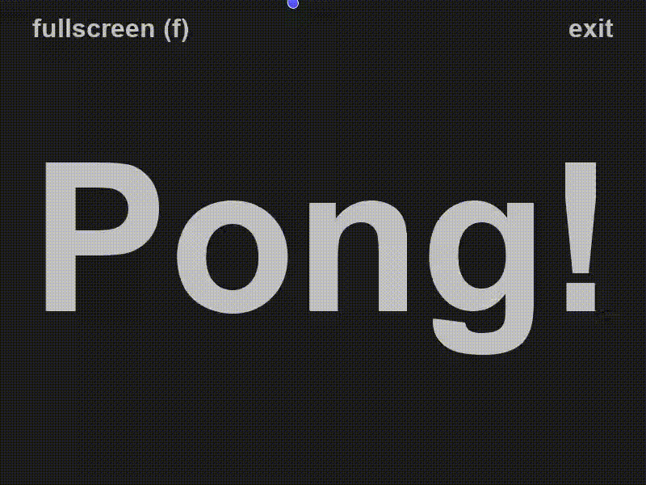

# Pong

Pong implementation in pygame, using PyInterfacer.

## Features

- Angle based reflection
- Sound effects
- Particles
- Fullscreen
- Controller support (player 1, left paddle)
- Framerate independent entity movement (using delta time)

\*GIF quality is not good :)
